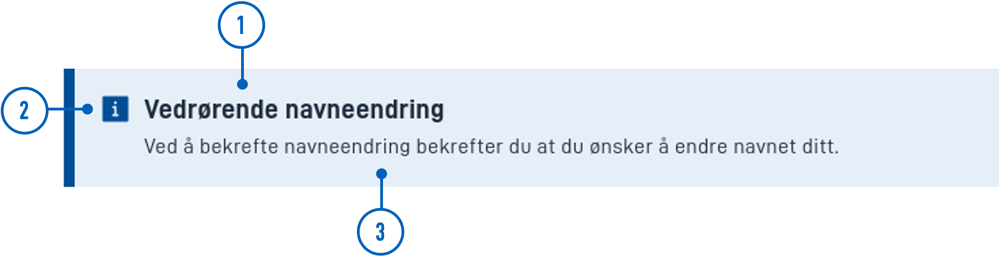

import Tabs from "@theme/Tabs";
import TabItem from "@theme/TabItem";
import DescriptionAlerts from "/src/components/DescriptionAlerts/DescriptionAlerts.tsx";

## Usage

Alerts are commonly used to display important information to users that should be highlighted.

### Anatomy



1. **Heading**: A brief and descriptive title.
2. **Icon**: A graphical symbol that conveys the severity of the alert.
3. **Text content**: The written information or message associated with the alert.

### Related

- [`Panel`](//)

## Properties

| **Property** | **Type** | **Description**                                                                                                                                         |
| ------------ | -------- | ------------------------------------------------------------------------------------------------------------------------------------------------------- |
| `severity`   | string   | String value indicating the severity level of the alert. This affect the styling of the alert. **Enum:** `"success" \| "info" \| "danger" \| "warning"` |

## Configuration

### Add component

You can add a component in [Altinn Studio Designer](./) by dragging it from the left-side panel to the middle page area.
Selecting the component brings up its configuration panel on the right-hand side.

<Tabs>
  <TabItem value="asd" label="Altinn Studio Designer" default>

Property settings available in Altinn Studio Designer.

<br />


<ul>
  <li>
    <strong>Komponent-ID</strong> (<code>id</code>): Automatically generated
    component ID (editable).
  </li>
  <li>
    <strong>Ledetekst</strong> (<code>textResourceBindings.title</code>): Alert
    heading.
  </li>
  <li>
    <strong>Tekstinnhold</strong> (<code>textResourceBindings.body</code>):
    Alert content.
  </li>
  <li>
    <strong>Alvorlighetsgrad</strong> (<code>severity</code>): Severity level.
    Influences the alert's styling (colors and icon).
  </li>
</ul>

  </TabItem>
  <TabItem value="code" label="Code">

```json title="App/ui/layouts/{page}.json"
{
  "data": {
    "layout": [
      // highlight-start
      {
        "id": "alert-id",
        "type": "Alert",
        "severity": "info",
        "textResourceBindings": {
          "title": "",
          "body": ""
        }
      }
      //highlight-end
    ]
  }
}
```
  </TabItem>
</Tabs>

### Alert severity

< DescriptionAlerts />

### Try it out!

To change alert severity, you have to select the current severity keyword and paste in one of the following:  
`error`, `warning`, `info`, `success`.

You can edit the title and content text as normal.

```jsx live
function alert() {
  return (
    <Alert severity="info">
        <AlertTitle><strong>Vedrørende navneendring</strong></AlertTitle>
        Ved å bekrefte navneendring bekrefter du at du ønsker å endre navnet ditt.
      </Alert>
  )
}
```
