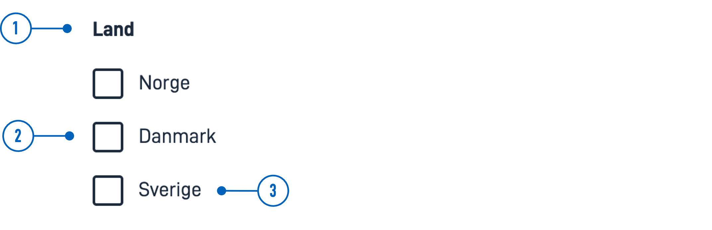

:::caution

🚧 This documentation is a work in progress.

:::

---

## Usage

Checkboxes are often used in forms to gather input from the user, allowing them to select one or more options from a list.

#### Use checkboxes when:
* Users can select multiple options from a list.
* An explicit choice needs to be made to use the settings (e.g., confirming that the user has read a document).

### Anatomy



{}
1. **Heading** - Question or instruction.
2. **Checkbox** - The choice control.
3. **Label** - Text label associated with the checkbox.
{}

### Style

* Checkboxes should always have an associated label on the right side.

### Best Practices

* Checkboxes with disabled options should be avoided.
    If an option is unavailable, it should be removed, and an explanation should be provided for why the option is missing.

### Content guidelines

* Keep labels short and descriptive.
* Start all labels with a capital letter.
* Do not include punctuation after labels.

### Related

* For a more compact way to display multiple options with multiple selection, use [MultipleSelect](./).
* If the user can only select one option from a list, use [RadioButtons](./).
* For a more compact way to display multiple options with single selection, use [Dropdown](./).

## Properties

The following is an autogenerated list of the properties available for {} based on the component's JSON schema file (linked below).

:::caution

We are currently updating how we implement components, and the list of properties may not be entirely accurate.

:::

{}

## Configuration

:::caution

We are currently updating Altinn Studio with more configuration options!
 The documentation is continuously updated, but more settings may be available than described here, and some settings may be in beta.

:::

### Add component


### Altinn Studio Designer.

You can add a component in [Altinn Studio Designer](./) by dragging it from the list of components to the page area.
Selecting the component brings up its configuration panel.


### Code

Basic component:


App/ui/layouts/{page}.json


```json{hl_lines="6-14"}
{
  "$schema": "https://altinncdn.no/schemas/json/layout/layout.schema.v1.json",
  {
    "data": {
      "layout": [
        {
          "id": "Image-id",
          "type": "Image",
          "image": {
            "src": {},
            "width": "100%",
            "align": "center"
          }
        }
      ]
    }
  }
}
```


<!-- ## Examples -->